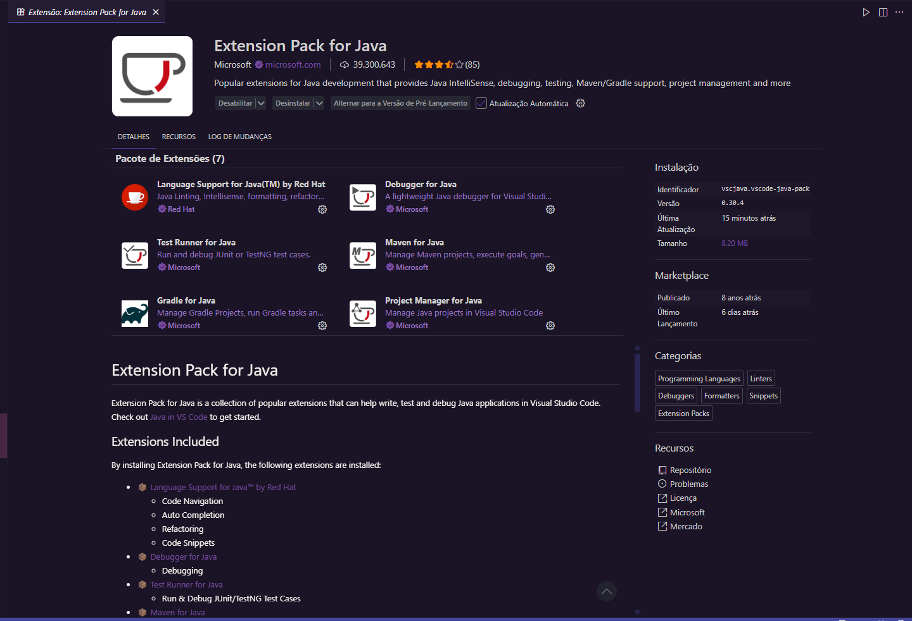
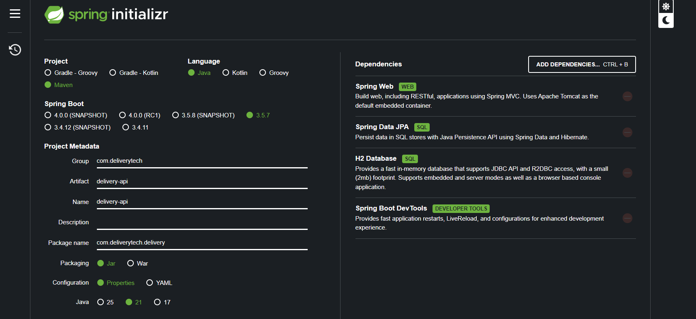
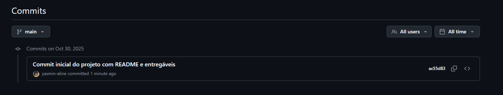
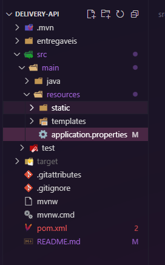
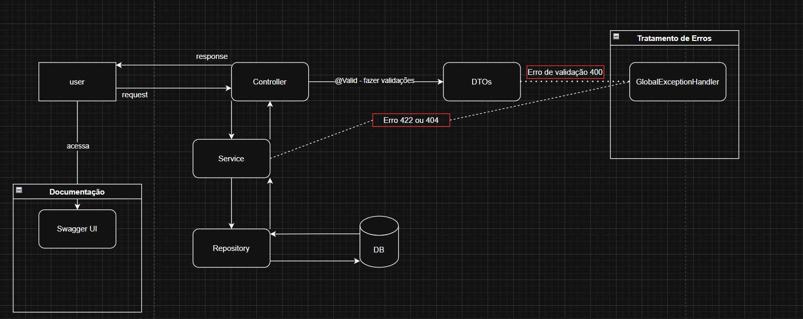
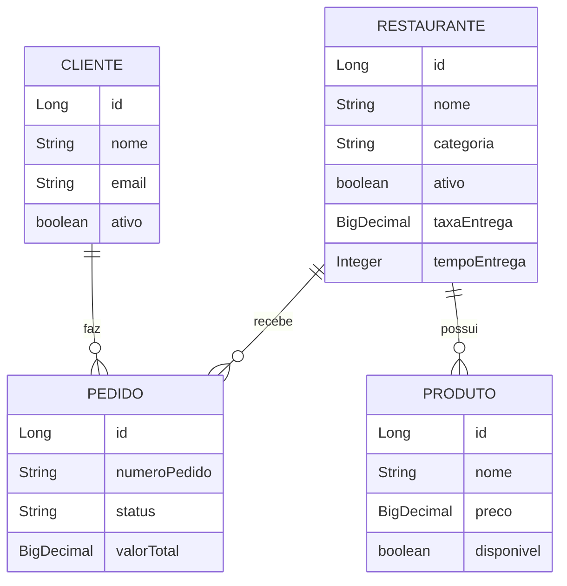
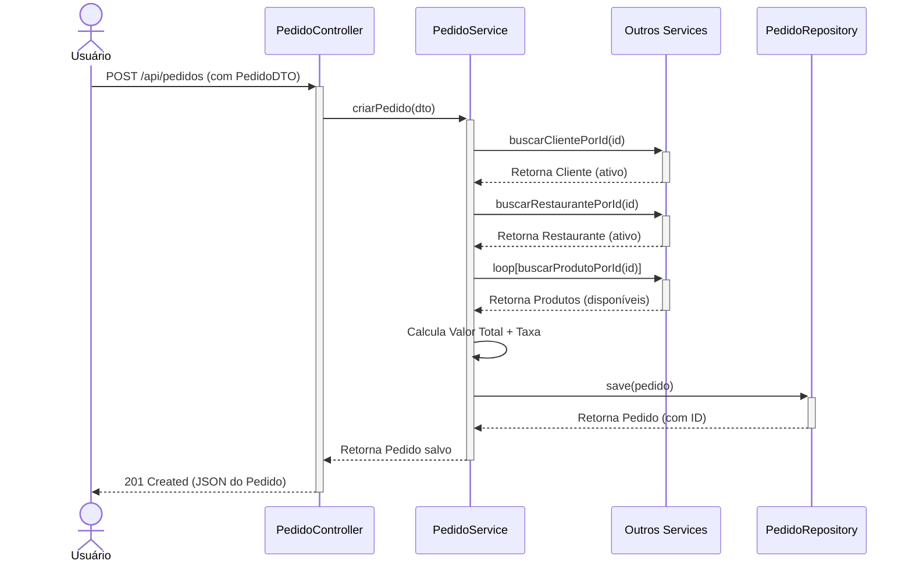
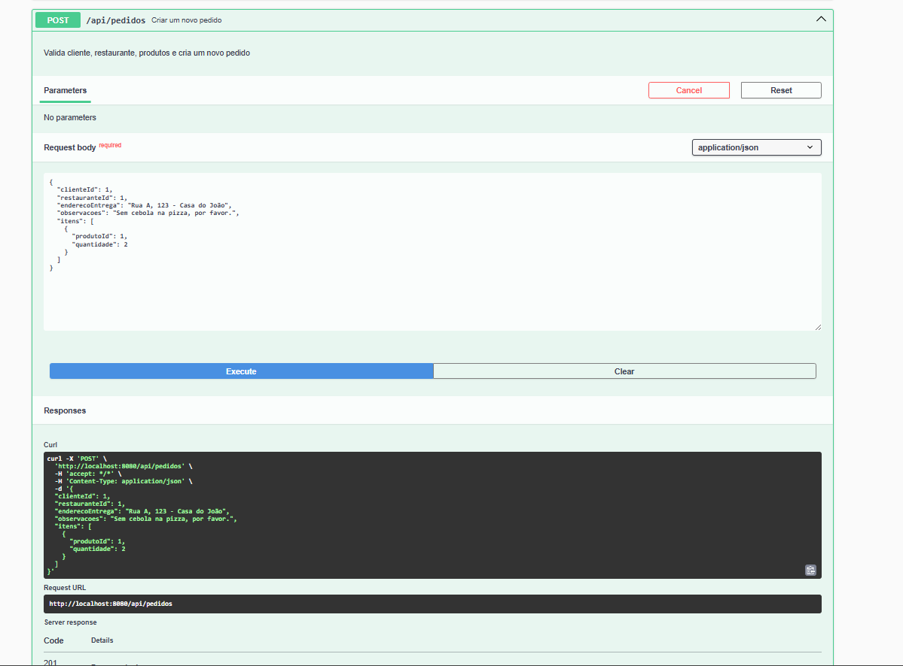
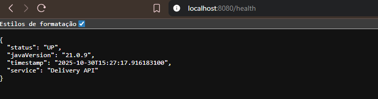

# Delivery Tech API
Sistema de delivery desenvolvido com Spring Boot e Java 21. 

## Tecnologias Utilizadas
- Java 21
- Spring Boot 3.2.5 (versão estável)
- Spring Data JPA (para persistência de dados)
- H2 Database (banco de dados em memória)
- Springdoc OpenAPI (Swagger) (para documentação da API)
- Spring Boot Validation (para validação de DTOs)
- ModelMapper (para mapeamento de DTOs)
- Maven (gerenciador de dependências)
- Lombok (para redução de boilerplate)

## Recursos Modernos Utilizados 
* Records (Java 14+) 
* Text Blocks (Java 15+) 
* Pattern Matching (Java 17+) 
* Virtual Threads (Java 21) 

## Como Executar o Projeto 

### Pré-requisitos

- JDK 21 
- Maven

### Clone o repositório:

```bash
git clone https://github.com/yasmin-aline/delivery-api-yasmin.git
cd delivery-api-yasmin
```

### Execute a aplicação:

```bash
./mvnw spring-boot:run
```

A API estará rodando em http://localhost:8080

---
## Principais Endpoints

- Documentação Swagger: `http://localhost:8080/swagger-ui/index.html`
- Console do Banco H2: `http://localhost:8080/h2-console`
- API Base: `http://localhost:8080/api`

## Configuração 
* Porta: 8080 
* Banco: H2 em memória 
* Profile: development 

## Desenvolvedor 
Yasmin Aline Amaral dos Santos

Desenvolvido com JDK 21 e Spring Boot 3.2.x 

---

## Entregáveis (Screenshots)
*Esta seção é para os entregáveis das Atividades 1-5.*

# Atividade 1: Ambiente (Java 21, Git e Extensões do VSCode)

## Java e Git funcionando


---
## Extensões VSCode



---

# Atividade 2: Spring Initializr (Java 21 selecionado)

Obs: Arquivo ZIP do projeto baixado do Spring Initializr está no diretório de entregáveis.

---

# Atividade 3: Commit Inicial no GitHub


---

# Atividade 4: Estrutura de Pastas


---

# Documentação do Projeto (Roteiros 2-6)

A seção abaixo detalha a arquitetura final e as funcionalidades profissionais da API, desenvolvidas durante o ciclo de vida completo do projeto.

## Visão Geral

Esta API gerencia todas as operações principais de um serviço de delivery (como iFood ou Uber Eats). Ela permite o gerenciamento de clientes, restaurantes, produtos e o processamento de pedidos de forma transacional e segura.

O projeto foi construído em 6 fases, evoluindo de uma aplicação básica para uma API REST robusta, documentada e com tratamento de erros padronizado.

## Principais Funcionalidades (Features)

* **Gestão de Pedidos:** Criação de pedidos transacionais, cancelamento e atualização de status.
* **Gestão de Restaurantes:** CRUD completo, filtros por categoria, status (ativo/inativo) e endpoints de relatório.
* **Gestão de Produtos:** CRUD completo, controle de disponibilidade e busca por restaurante ou categoria.
* **Gestão de Clientes:** CRUD completo e controle de status (ativo/inativo).
* **Relatórios:** Endpoints para relatórios de vendas (via `@Query` e Projeções JPQL).
* **Validação Robusta:** Tratamento de erros padronizado (`@ControllerAdvice`) e validação de DTOs (`@Valid`) para todas as entradas.
* **Documentação Interativa:** API 100% documentada com Swagger (OpenAPI).

---

## Arquitetura do Sistema

A API segue uma arquitetura em camadas (Three-Layer Architecture) para garantir a separação de responsabilidades (SoC).

### Diagrama de Componentes

Este diagrama mostra a visão geral de como os componentes se comunicam:



## Diagrama de Entidade-Relacionamento (ERD)

O diagrama abaixo mostra como as principais entidades do banco de dados se relacionam:



## Fluxo Principal: Criação de um Pedido

O caso de uso mais crítico é a criação de um pedido. Este diagrama de sequência mostra como as camadas interagem de forma transacional para garantir a integridade dos dados:



## Documentação da API (Swagger)

A API está 100% documentada usando Springdoc OpenAPI (Swagger). A documentação é gerada automaticamente a partir do código, garantindo que esteja sempre atualizada.

Acesse a documentação interativa localmente após iniciar o projeto:

http://localhost:8080/swagger-ui/index.html



# Atividade 5: Endpoint Funcionando

