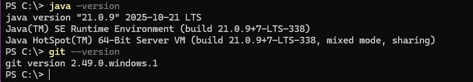

#Delivery Tech API
Sistema de delivery desenvolvido com Spring Boot e Java 21.

## Tecnologias
**Java 21 LTS** (versão mais recente)
Spring Boot 3.2.x
Spring Web
Spring Data JPA
H2 Database
Maven

## Recursos Modernos Utilizados
Records (Java 14+)
Text Blocks (Java 15+)
Pattern Matching (Java 17+)
Virtual Threads (Java 21)

## Como executar
1. **Pré-requisitos:** JDK 21 instalado
2. Clone o repositório
3. Execute: /mvnw spring-boot:run
4. Acesse: http://localhost:8080/health

## Endpoints
GET /health Status da aplicação (inclui versão Java)
GET/info Informações da aplicação
GET/h2-console Console do banco H2

## Configuração
Porta: 8080
Banco: H2 em memória
Profile: development

## Entregáveis (Screenshots)
*Esta seção é para os entregáveis das Atividades 1-5.*

**Atividade 1: Ambiente (Java 21, VSCode, Git)**

**Atividade 2: Spring Initializr (Java 21 selecionado)**

Obs: Arquivo ZIP do projeto baixado do Spring Initializr está no diretório de entregáveis.

**Atividade 3: Commit Inicial no GitHub**

**Atividade 4: Estrutura de Pastas**

**Atividade 5: Endpoint Funcionando**

## Desenvolvedor
Yasmin Aline Amaral dos Santos
Desenvolvido com JDK 21 e Spring Boot 3.2.x
